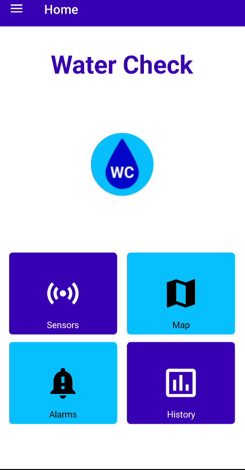
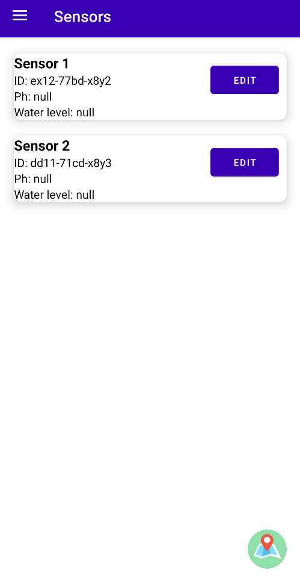
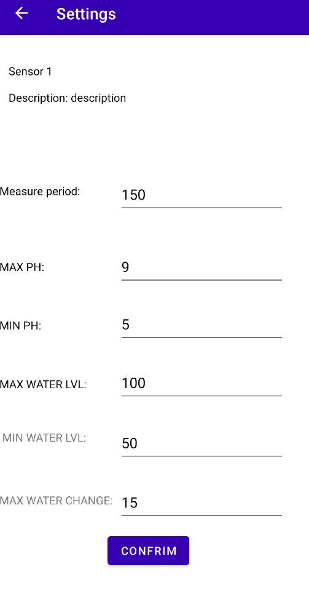
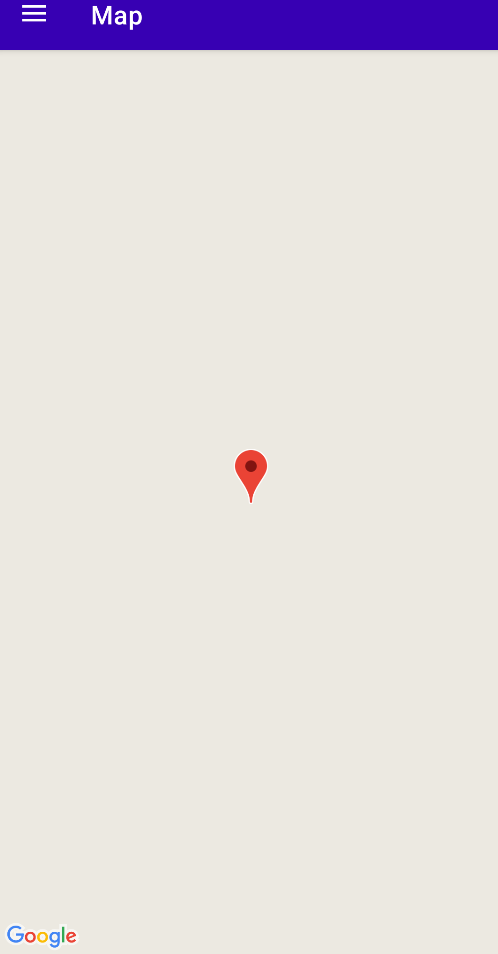
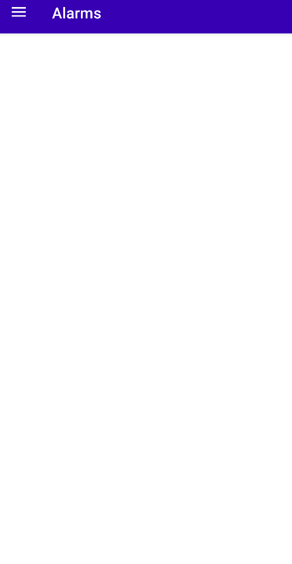
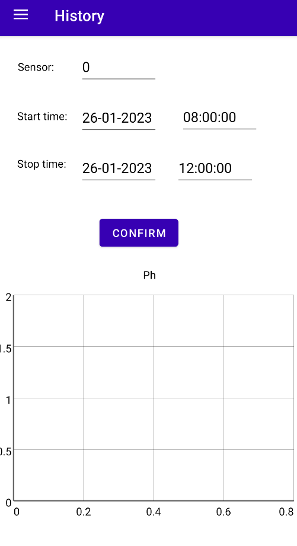
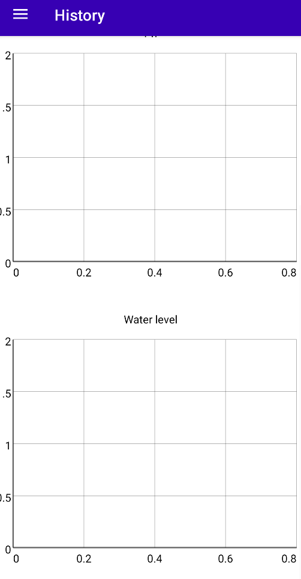

# WaterCheck

## Overview

WaterCheck is a project focused on measuring water level and ph values in rivers, controlling sensors digitally, storing data from them and visualising this data.

It was created by Adam Pomorski, Michał Ciesielski, Julia Dasiewicz, Karol Duszczyk on PBL5 classes (winter 2022) as a part of the Internet of Things studies at the Warsaw University of Technology.

Part of this project was creating mobile application with given features:
- visualising current measurements from sensors
- alarming user when the set limits of water level and ph are reached
- controlling the measurement periods of sensors
- visualising historical data from sensors

## Application views



Home screen layout consist of logo of the project and 4 buttons that are redirecting to the rest of the main views in the application.



Sensors view presents the list of currently working sensors with their record number, id, current ph and water level values. On the right hand side of each row there is a "Edit" button which leads to the settings section of particular sensor



Settings view presents sensor's record number and description at the top. Then below these section there are several values that are possible to change( by pressing confirm button at the bottom): measure period, max/min ph and water level. Measure period value is sent to the server after confirmation and then all the values are stored in application's internal memory so that each user can have individual values of alarms.



Maps view is working on the Google Maps API where each sensor has its location on the map. By clicking the marker u are redirected to the settings section of particular sensor. Currently this feature is not working because the free trial in Google Cloud has expired so to not generate additional costs this feature has been closed. Although it is really easy to attach it to individual Google Cloud Account by generating API KEY and adding it to AndroidManifest.xml.



Alarms view presents the list of alarms that occured from the start of application.





History view presents the menu to choose particular id and period of time from which the user would like to view data. Underneath this section there are two charts which refresh every time the confirm button is pressed. 

## How to use it
### Server emulation
As the application was a part of bigger project it was highly correlated with the server and database which are currently not maintained. Because of that to run this application I created two simple Mqtt Clients using Paho library in Python, which are emulating basic features of real server. File paho_server.py is responsible for responding to application requests such as sensor list request, history request and changing measure period request. File paho_publish.py is responsible for sending pseudo-random emulated data from sensors to the Mqtt Broker.

### Limitations
In this version of the project the clients are emulating some features of the server only partially.<br><br>
Sensors:
<ul>
<li>there are only two sensors set in paho_server</li>
<li>the data is only emulated for one sensor</li>
</ul>
Settings:<br><br>
<ul>
<li>it is not possible to change the measure period of given sensor as it is statically set in paho_publish</li>
</ul>
History:<br><br>
<ul>
<li>the timestamps are not being checked and for each sensor there are always the same data points represented on the graphs</li>
</ul>

### Running the project

There are two options to run the application: 
- open the /application folder in Android Studio environment and run it from the GUI
- download the WaterCheck.apk file from /run folder and run the application on the mobile device

To run python clients you need:
- python3 (in my case 3.9.13)
- python library paho-mqtt
```
pip3 install paho-mqtt
```
Both of the clients should be working while you are using the application to see all the available functionalities.
